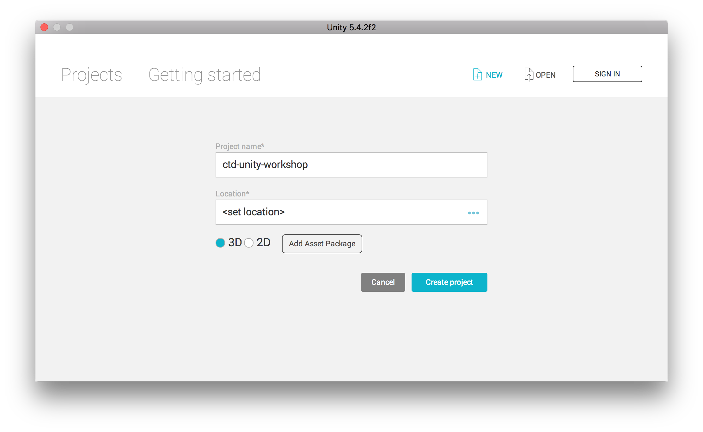
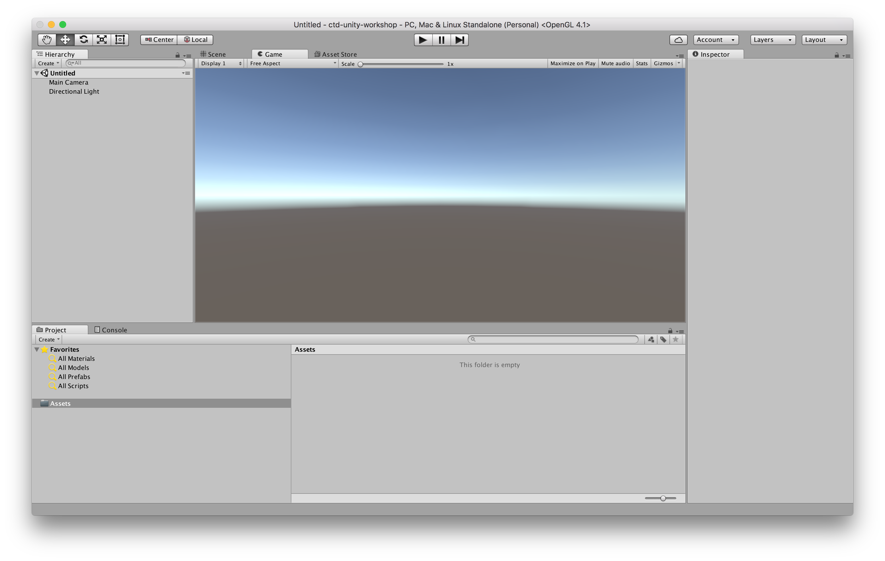
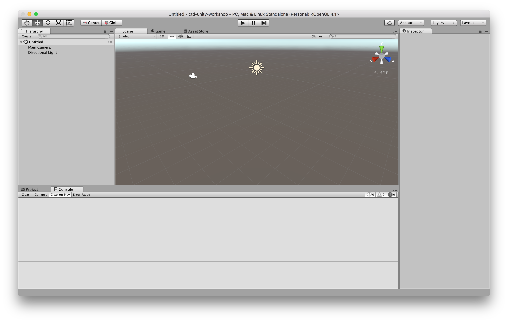

# Unity

## Setup Unity

* Download and install [Unity 5.4.2f2](https://unity3d.com).
* Create a Unity ID (user account for Unity).
* Login with Unity ID.
* Create new project.

## Interface

The core of the unity interface consists of five main panels:

* The `Scene View` is where you'll visually construct your game, manipulating objects in 2D and 3D.
* The `Game View` is where you will preview your application and this becomes active when you hit the play button.
* The `Hierarchy` lists all objects in the scene in hierarchical order in order to show parenting - a way of grouping objects.
* The `Project` panel shows all assets that you are currently working with.
* The `Inspector` is a context sensitive panel that shows the properties of whatever object, asset or setting panel you've selected.

Check out the Unity tutorials ["Interface & Essentials"](https://unity3d.com/de/learn/tutorials/topics/interface-essentials
) for more details about the interface.

## Scene View

The `Scene view` is where you will visually construct your game. And this can be navigated by making use of the buttons above the view.

* The first button, the `Hand Tool`, is purely for navigating. With this tool selected drag with the left mouse button to pan, and with the right mouse button to look around first person style (WASD). With any object selected in the hierarchy you can focus on the object by double clicking the object's name.
* The remaining three buttons allow you adjust position, rotation and scale of objects.

Check out the Unity tutorials ["Interface & Essentials"](https://unity3d.com/de/learn/tutorials/topics/interface-essentials) for more details about the scene view.
