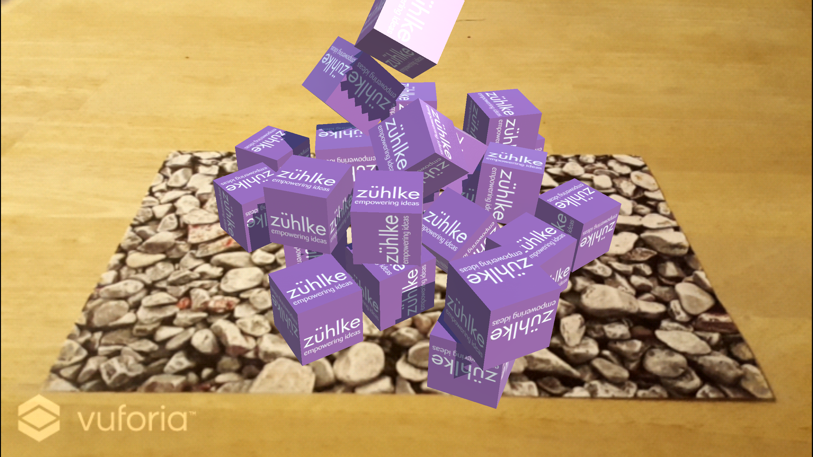

# Introduction

The goal of the workshop is to show how to build an augmented reality applications using the Unity editor and the Vuforia extension for Unity. The idea of the projects is to display falling cubes if an image target is recognized - including physical interactions.

You can find the resulting unity project of this workshop at: [https://github.com/lakermann/ar-with-unity-workshop](https://github.com/lakermann/ar-with-unity-workshop).

You can find out more info as well as documentation about Unity and Vuforia at:

* [unity3d.com](https://unity3d.com)
* [developer.vuforia.com](https://developer.vuforia.com)

