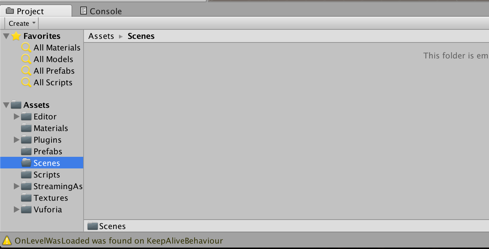
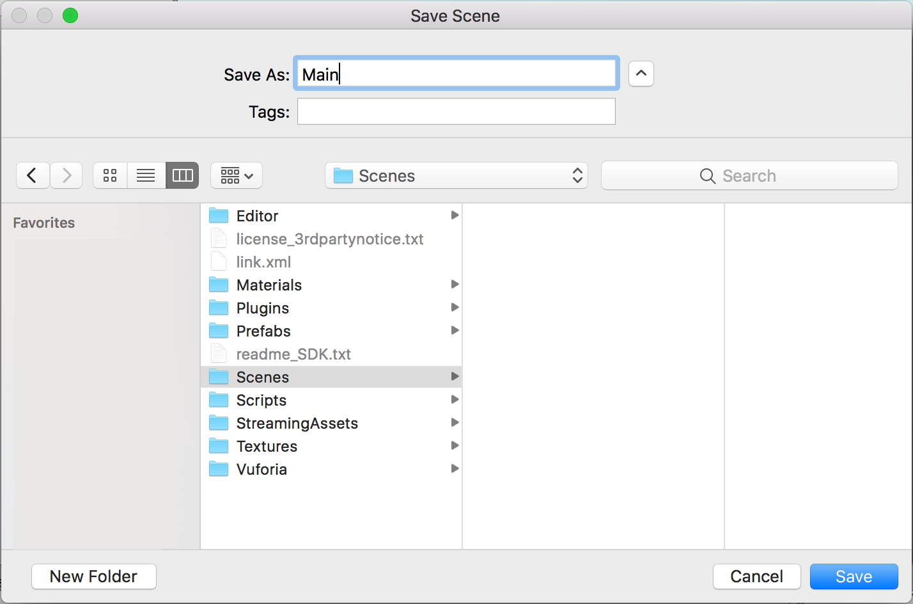
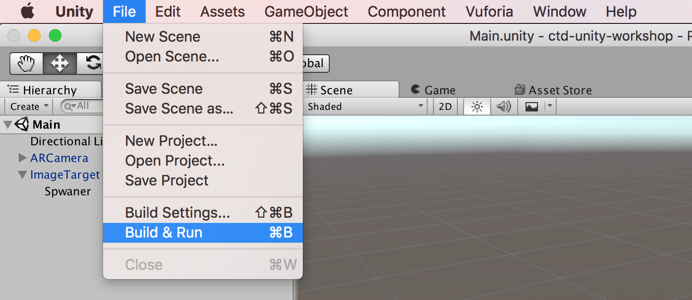
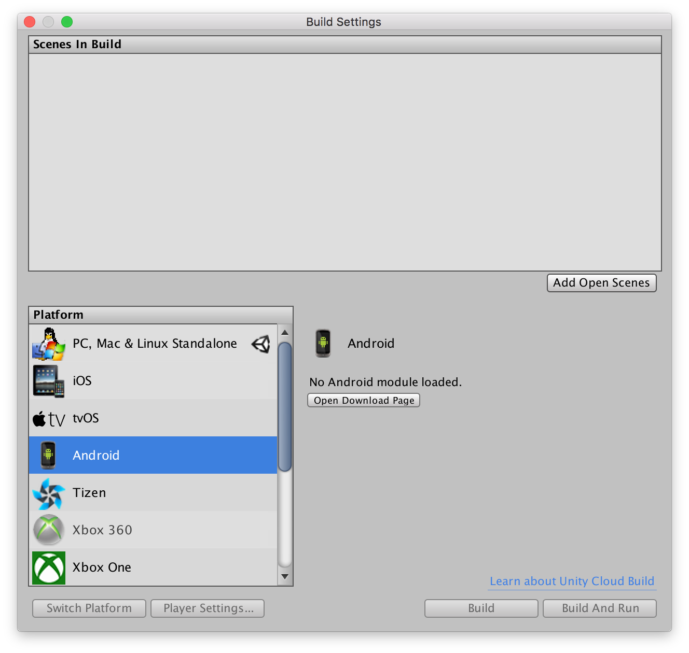
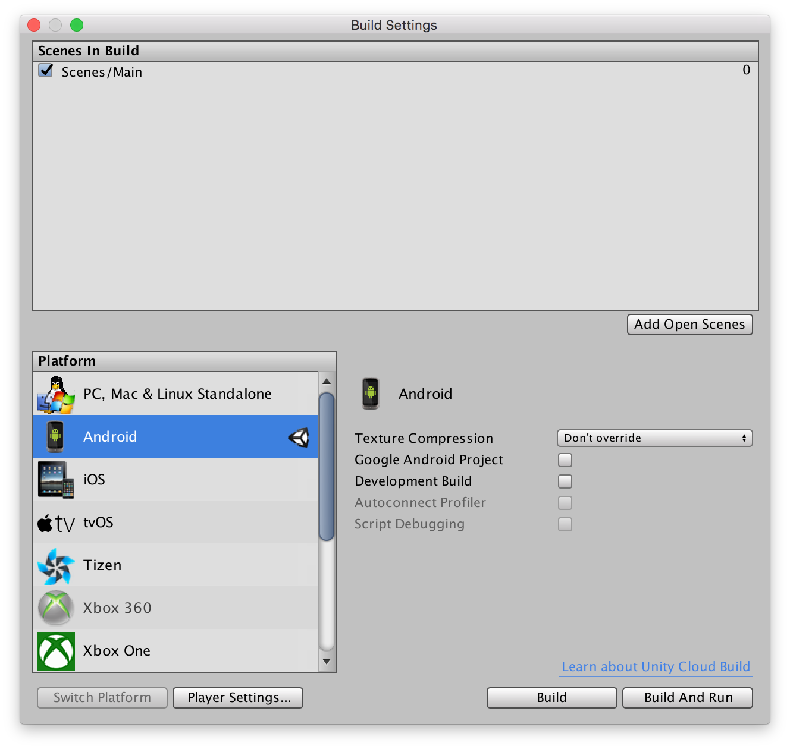
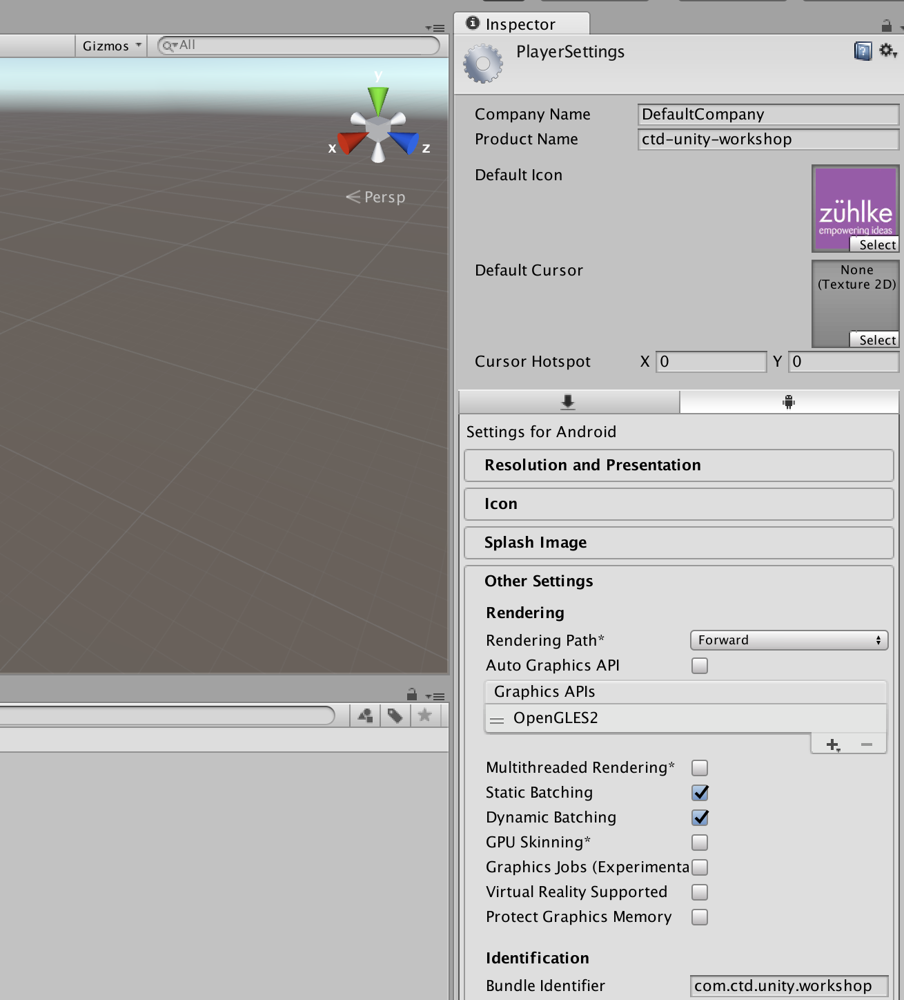
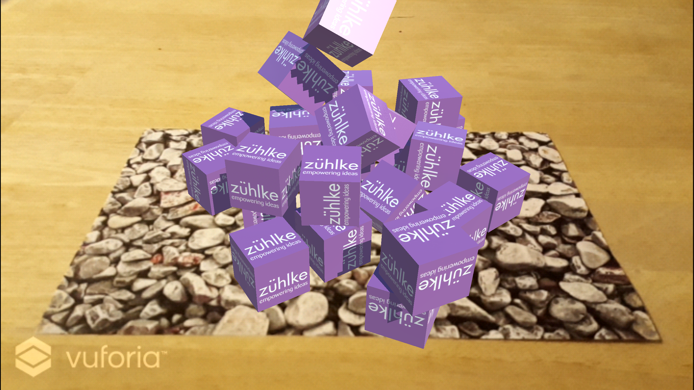

# Build App

We will save the scene and create an android app.

* Create folder `Scenes`:

* Save the current scene:

Now we will make an android build.

* Install [Android SDK](https://developer.android.com/).
* Select `Build and Run`:

* Select Android Platform and click on `Open Download Page`:

* Install Unity Android module and restart Unity.
* Select `Build and Run`.
* `Add Open Scene` to add current scene to the build and `switch platform` to `Android`:

* Select `Player Settings`.
* Drag texture on `default icon` and set `Bundle Identifier` to com.ctd.unity.workshop:

* Connect your android smartphone.
* Select `Build and Run` in the Build Settings dialog.
* Set path to Android SDK in the popup dialog.

The application will be build and deployed to the android phone.

* Test the application on the phone.

