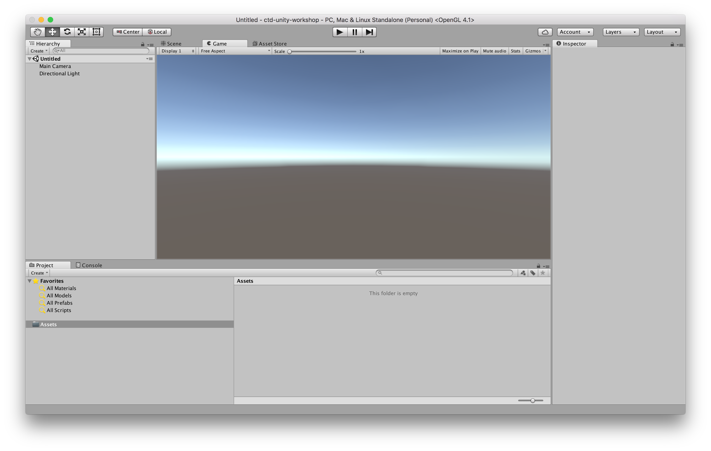

# Interface

The core of the unity interface consists of five main panels:

* The `Scene View` is where you'll visually construct your game, manipulating objects in 2D and 3D.
* The `Game View` is where you will preview your application and this becomes active when you hit the play button.
* The `Hierarchy` lists all objects in the scene in hierarchical order in order to show parenting - a way of grouping objects.
* The `Project` panel shows all assets that you are currently working with.
* The `Inspector` is a context sensitive panel that shows the properties of whatever object, asset or setting panel you've selected.

Check out the Unity tutorials ["Interface & Essentials"][unity-tutorials] for more details about the interface.

[unity-tutorials]:      https://unity3d.com/de/learn/tutorials/topics/interface-essentials
