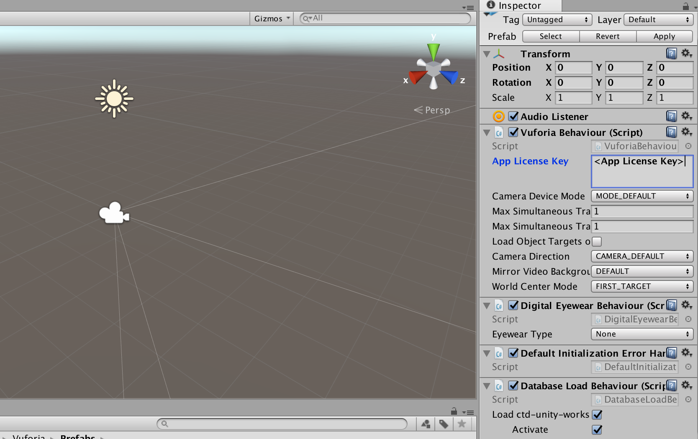
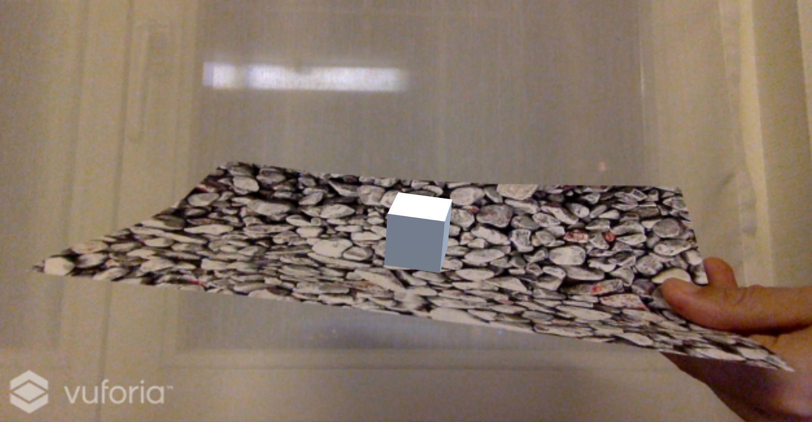
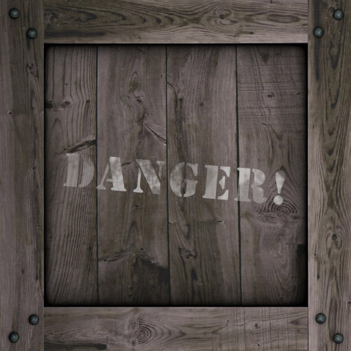
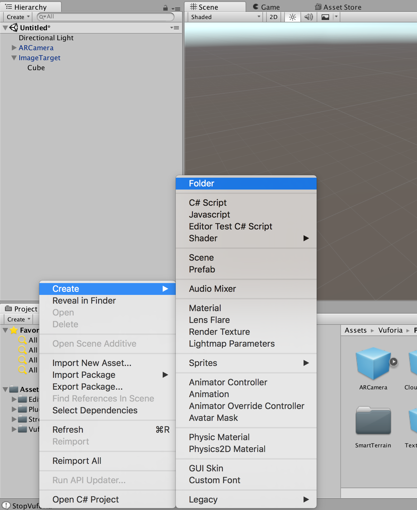
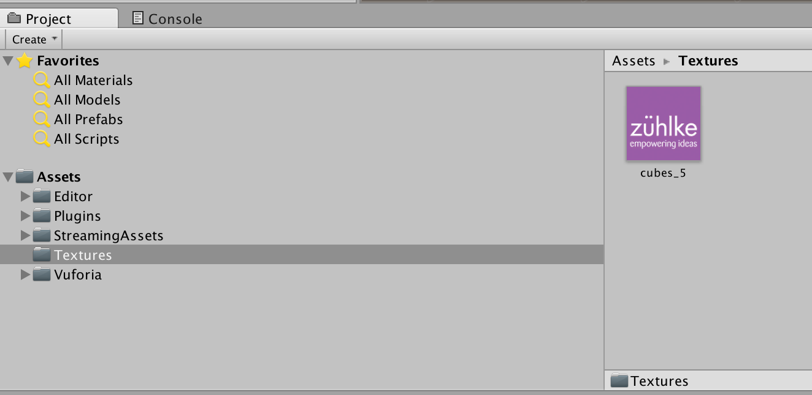

# Scene

## Setup Camera

Now let’s setup the scene. The first thing we are going to do is to delete the default `main camera`. Vuforia provides a custom camera prefab specifically designed for AR applications.  That’s why it’s called the `ARCamera`:

When you highlight the camera prefab, its component and properties are presented in the inspector panel. Here we have to set the `App License Key` - you can copy paste it from the [Vuforia License Manager](https://developer.vuforia.com/targetmanager/). Another field we will set is the `Database Load Behavior`, where we specify which device database (ctd-unity-workshop) to load and activate:

## Add Image Target

No let’s add an `image target` to the scene. Image targets represent images that the Vuforia SDK can detect and track. The SDK detects and tracks the features that are naturally found in the image itself by comparing these natural features against a known target resource database. Once the image target is detected, the SDK will track the image as long as it is at least partially in the camera’s field of view.

* We add an image target to the scene by dragging the prefab into the hierarchy:

* We configure the image target component by selecting the `Database` contains the trackable image target we are going to use:

## Add Cubes

* Now we are ready to add a cube:

This object must be a child of the image target:

* Set the `Position` and the `Scale`:

* Press the play button and test the preview:

* Download one texture for the cube (save the image):

| Texture 1                        | Texture 2                        | Texture 3                        |
| -------------------------------- | -------------------------------- | -------------------------------- |
|  |  |  |

* Create a new folder `Textures`:

* Drag the downloaded texture in the `Textures` folder. A texture is an image straight out of an image processing program like Photoshop:

* Drag the texture from the folder on the cube:

You see now that a new material is created automatically. A material is the details of what an object should look like including albedo, emission, reflections etc:

* Press the play button and test the preview:

