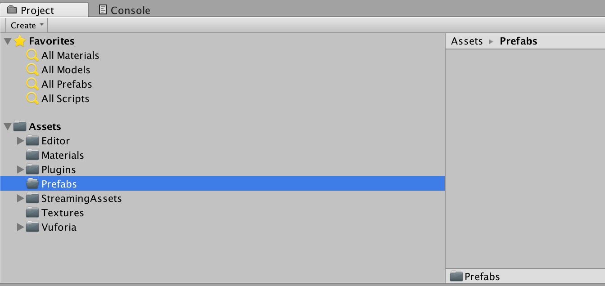
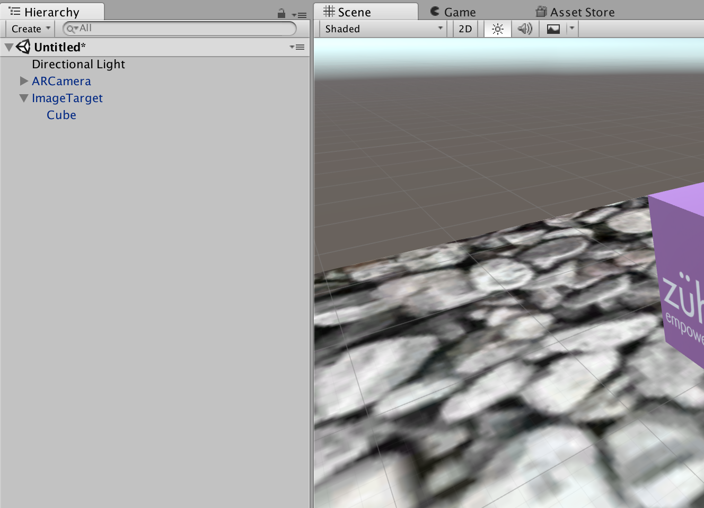
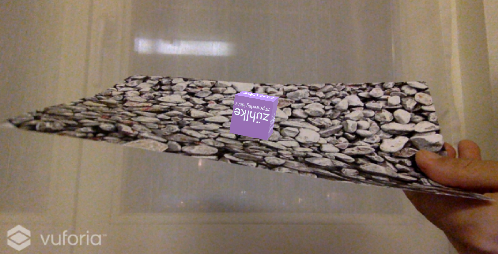
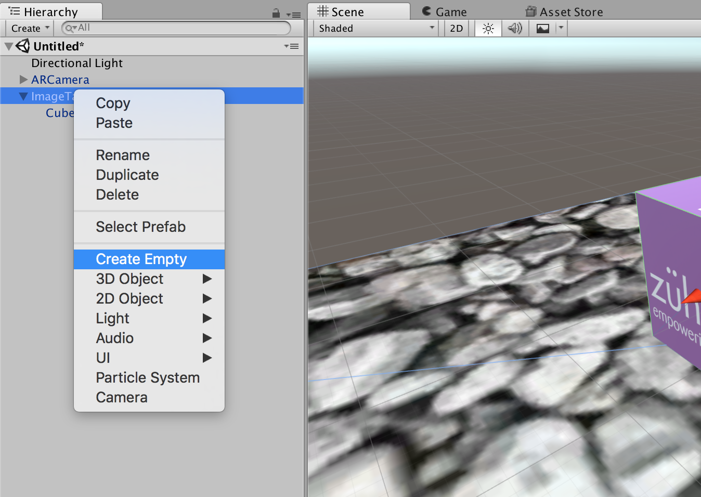
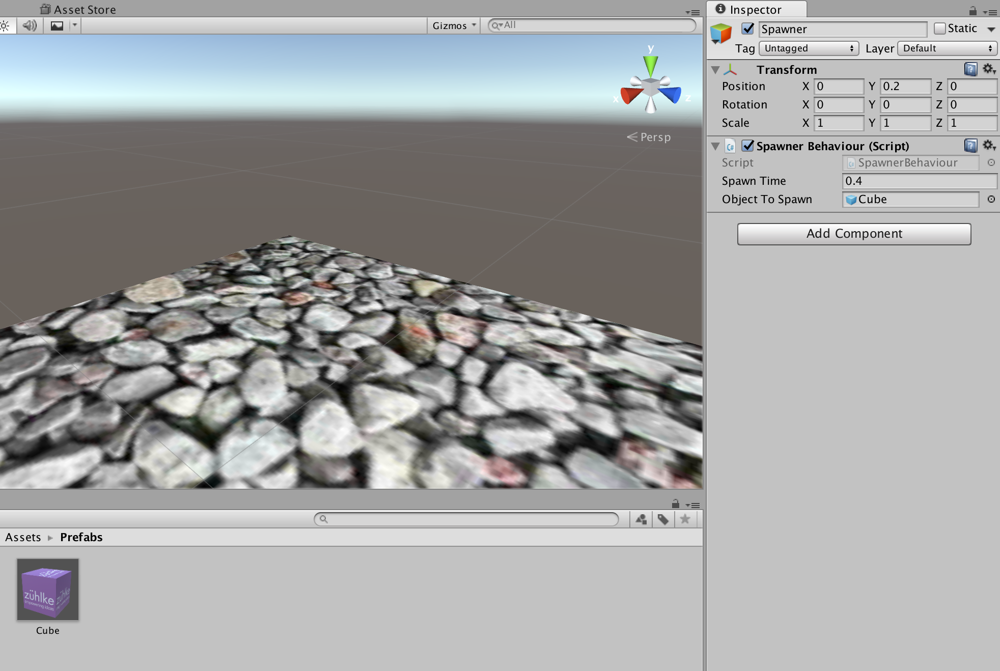
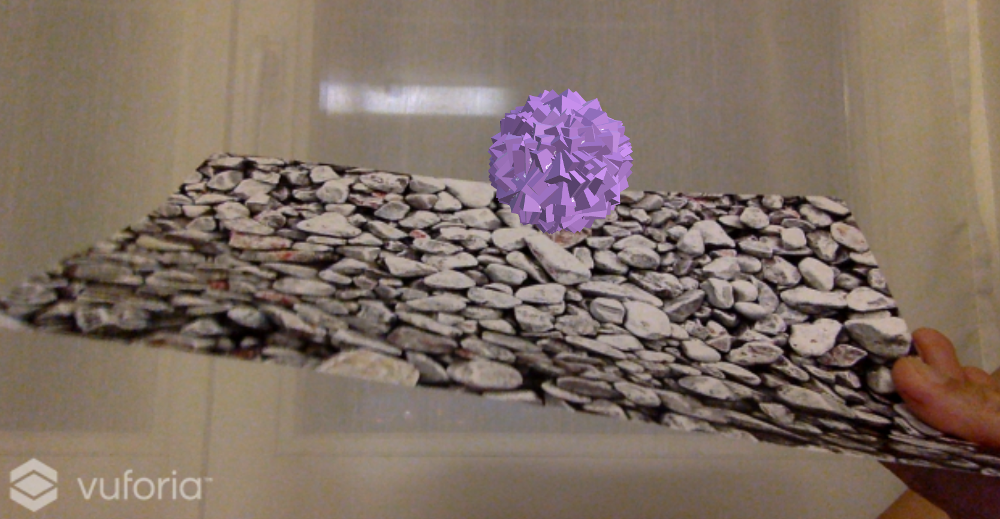
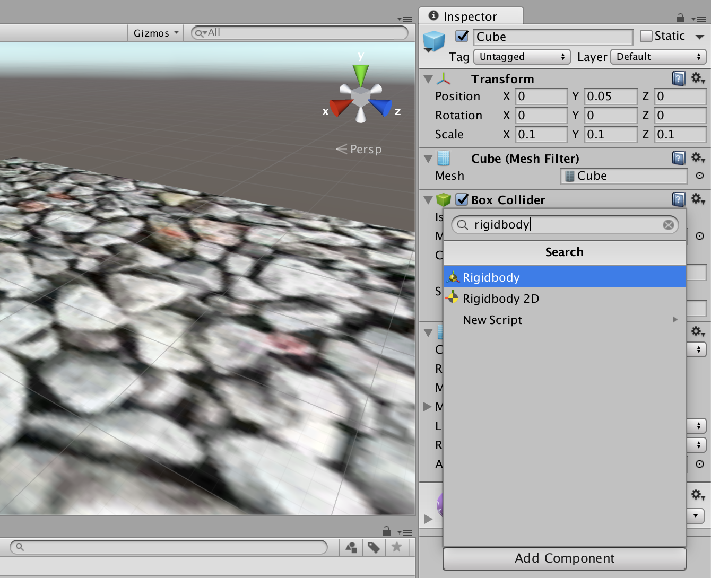
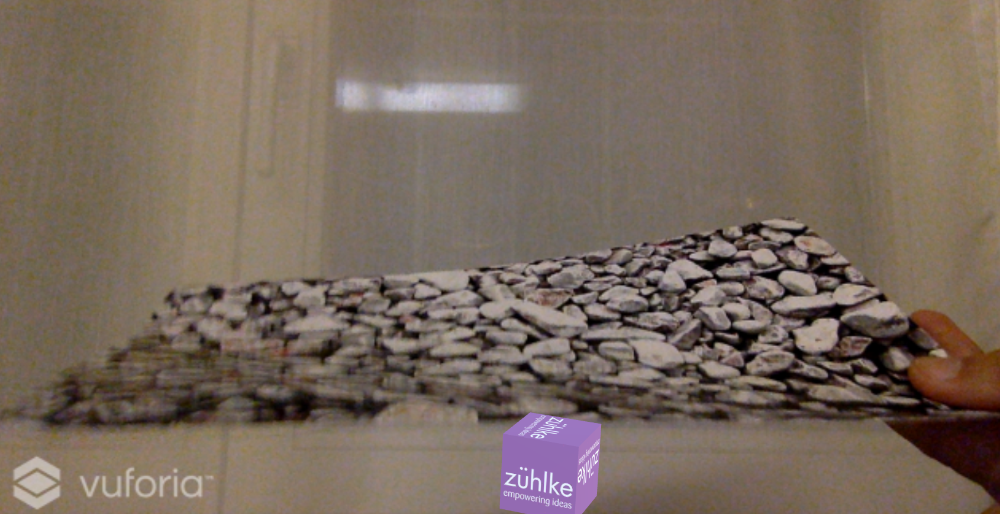
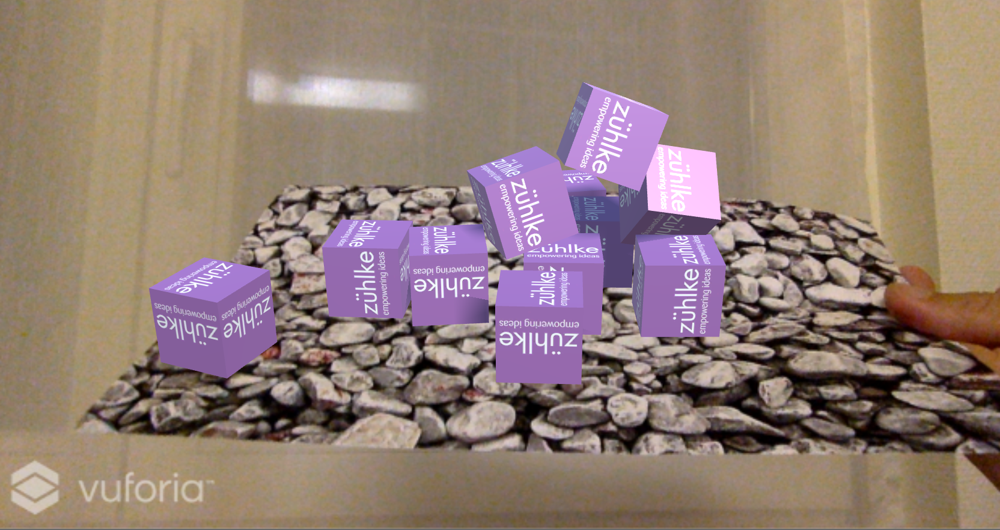
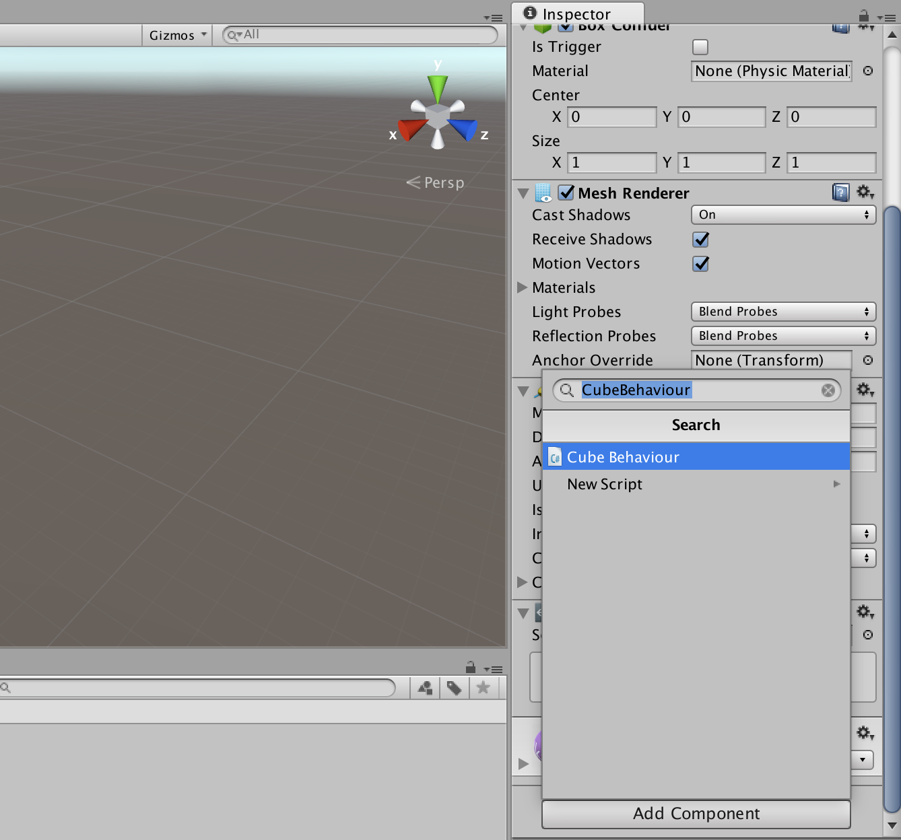

# Scripts

## Create Prefab

Prefabs in Unity are preconfigured game objects that you create in the scene and store in the project. They can then be instantiated or cloned, meaning to create an instance of them during the game.

* Create folder `Prefabs`:



* Drag cube in folder `Prefabs` and delete cube in hierarchy:


* Drag cube prefab to image target:



* Press the play button and test the preview:



## Create Spawner

We will create a spawner that creates the falling cubes.

* Create an empty `game object`:



* Set `name` and `position`:


We will add a script to the spawner in order to create the falling cubes.

* Create a new folder `Scripts`:


* Add a C# script with filename `SpawnerBehaviour.cs`:


* Insert the following C# code:

```c
using UnityEngine;
using System.Collections;

public class SpawnerBehaviour : MonoBehaviour {

    public float spawnTime = 0.4f;        // How long between each spawn.
    public GameObject objectToSpawn;

    // Use this for initialization
    void Start () {
        // Call the Spawn function after a delay of the spawnTime and then continue to call after the same amount of time.
        InvokeRepeating ("Spawn", spawnTime, spawnTime);
    }

    void Spawn () {
        Instantiate (objectToSpawn, gameObject.transform.position, Random.rotation);
    }
}
```

* Drag the script on the `Spawner` in the hierarchy view:


* Remove the `Cube` from hierarchy:


* Drag cube prefab to public variable `Object to Spawn`.



* Press the play button and test the preview:



Rigidbodies enable your GameObjects to act under the control of physics. The Rigidbody can receive forces and torque to make your objects move in a realistic way:

* Add a Rigidbody to Cube prefab.



* Press the play button and test the preview:



Colliders are a component that allows the game object they're attached to to react to other colliders provided that one of the game objects has a rigidbody component attached.

* Add a Box Collider to Image target:


* Press the play button and test the preview:



The spawn point is not high enough and there are a lot of cubes. So we will change the Y axis of the spawn point and make a script to destroy the cubes after a certain period.

* Set the Spawner `position`:


## Modify Cubes

We will add a script to the cube in order to destroy it after 10 seconds.

* Create a new C# script with filename `CubeBehaviour.cs` and insert the following code:

```c
using UnityEngine;
using System.Collections;

public class CubeBehaviour : MonoBehaviour {

    public float lifeTime;

    // Use this for initialization
    void Start () {
        Object.Destroy (gameObject, lifeTime);
    }

    // Update is called once per frame
    void Update () {

    }
}
```

* Add the script to the `Cube` prefab:



* Set the public variable `Life Time` to 10:


* Press the play button and test the preview:


