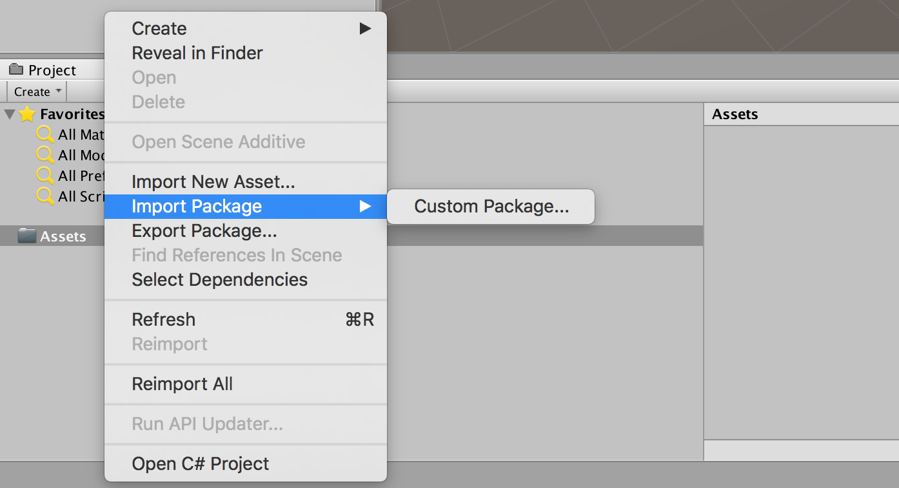
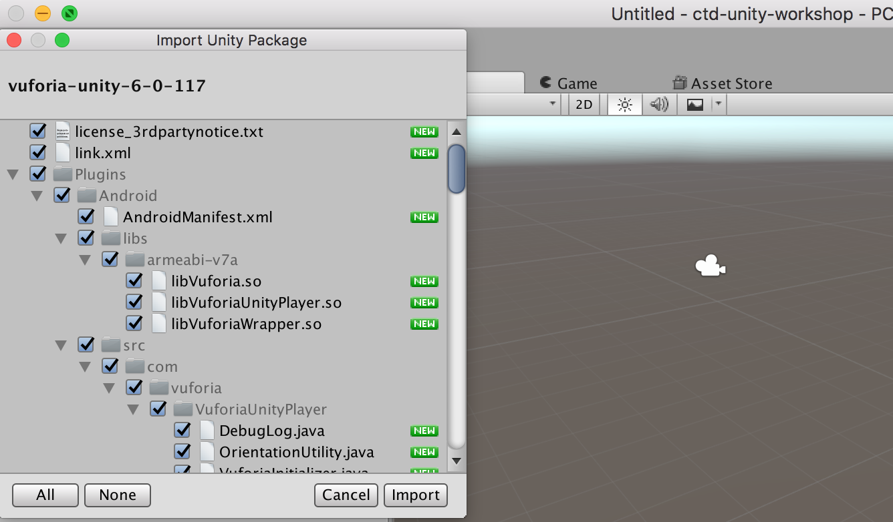
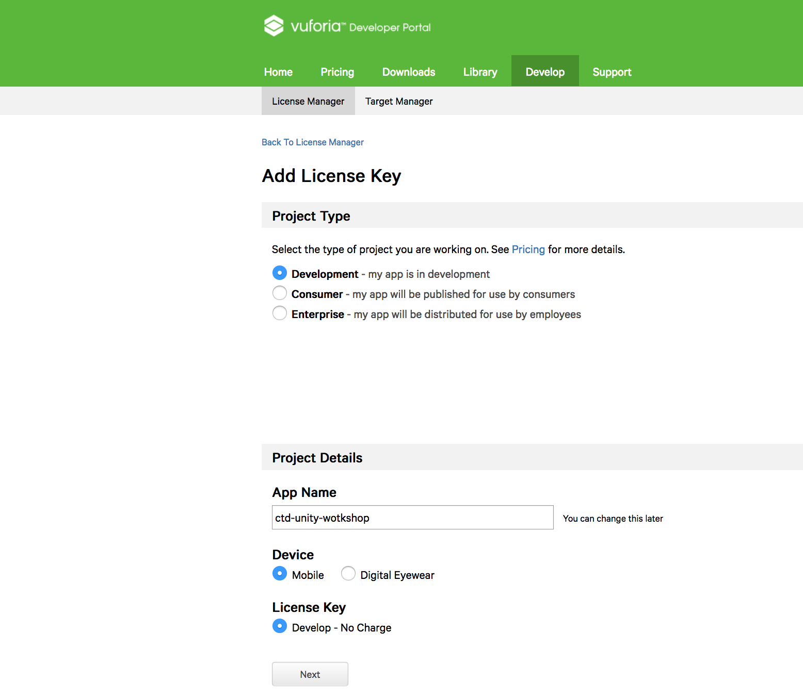
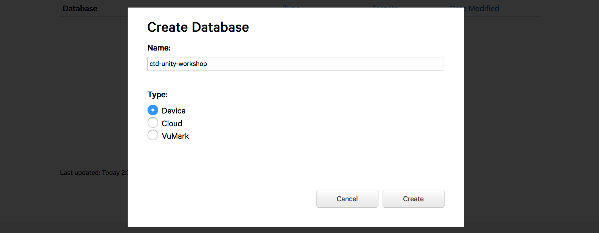
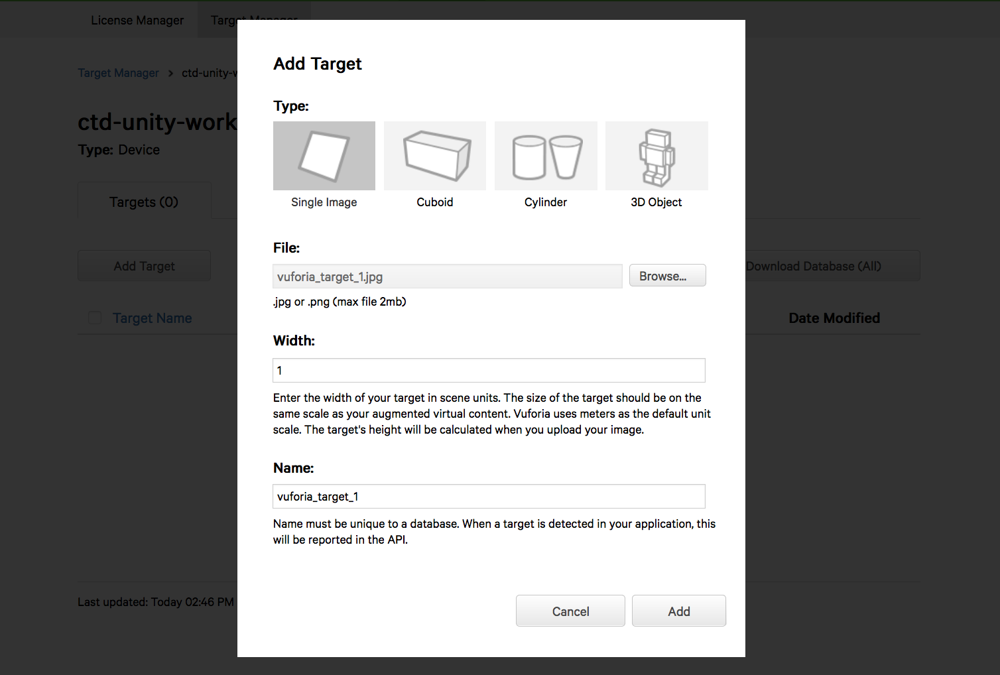
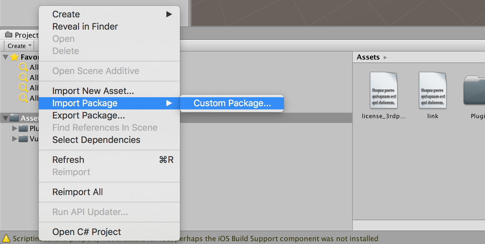
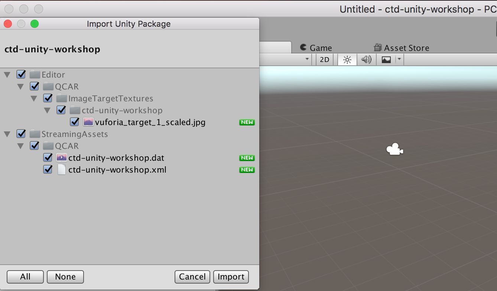

# Vuforia

## Import Vuforia Extension

Vuforia enables you to create holographic apps that can recognize specific things in the environment so that you can attach experiences to them.

* Download [vuforia-unity-6-0-117.unitypackage](https://developer.vuforia.com/downloads/sdk).
* Import custom package in Unity.

The import of the vuforia extension will create a set of new folders in our project:

## Import Vuforia Target Database

Image Targets represent images that the Vuforia SDK can detect and track. We will use the following image as target (download and save the image `vuforia_target_1.jpg`):

* Create an [Vuforia Account](https://developer.vuforia.com) and sign in.
* Add a [license key](https://developer.vuforia.com/targetmanager/):

* Add a target database:

* Select the created database and add a target.
* Select the downloaded `vuforia_target_1.jpg`, set the size to 1 and add it:

* Download the target database for Unity:

* Import the target database as custom package in Unity:

The import of the target database will create a set of new folders in our project:

