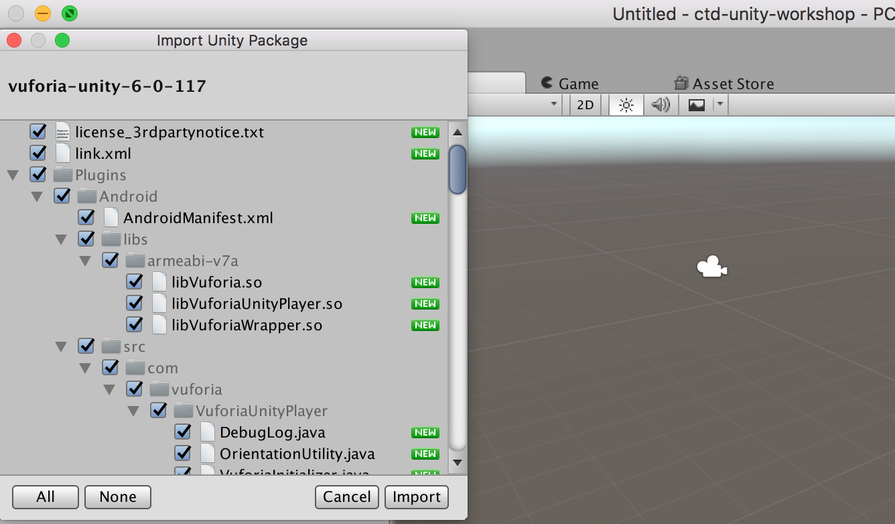

# 4. Import Vuforia Extension

Vuforia enables you to create holographic apps that can recognize specific things in the environment so that you can attach experiences to them.

* Download [vuforia-unity-6-0-117.unitypackage][vuforia-download].
* Import custom package in Unity.

The import of the vuforia extension will create a set of new folders in our project:

[vuforia-download]:      https://developer.vuforia.com/downloads/sdk
