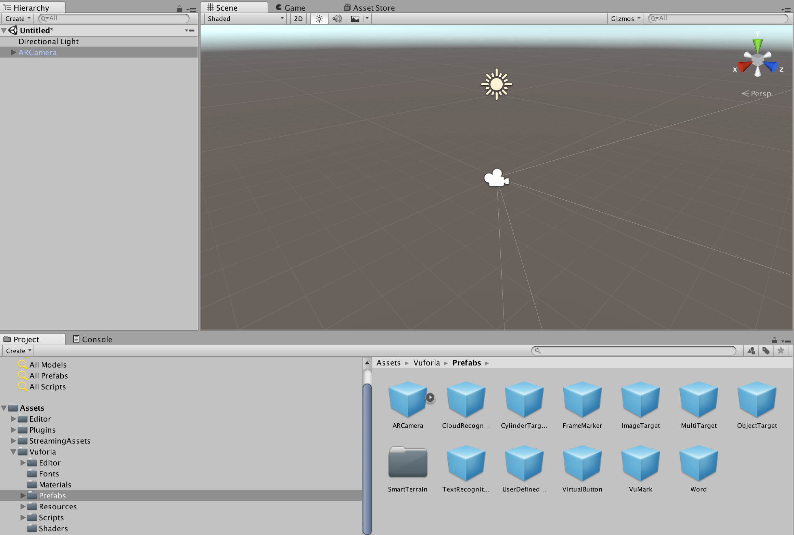
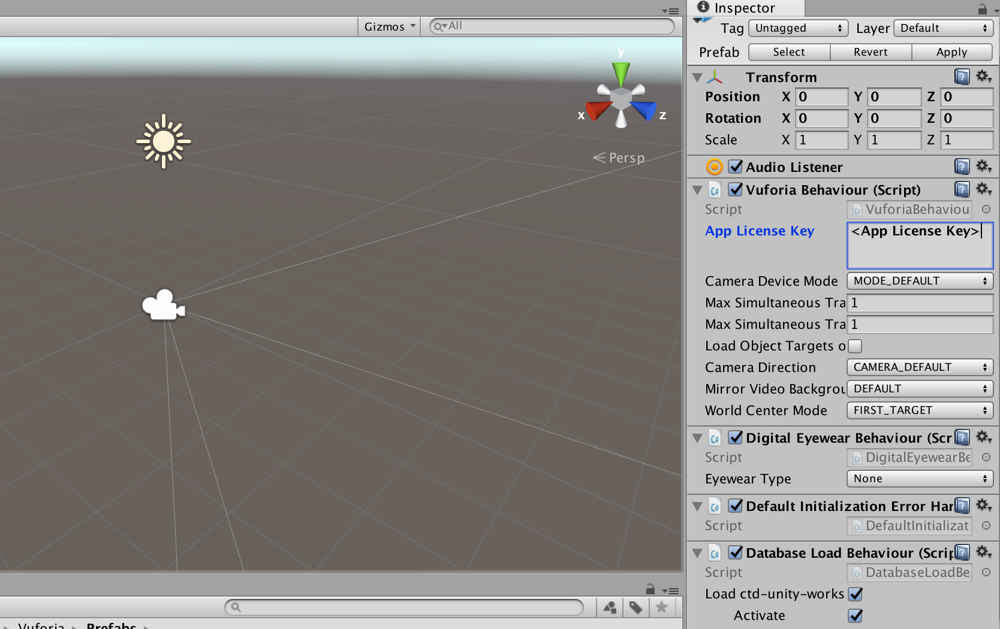

# 6. Setup Camera

Now let’s setup the scene. The first thing we are going to do is to delete the default `main camera`. Vuforia provides a custom camera prefab specifically designed for AR applications.  That’s why it’s called the `ARCamera`:

When you highlight the camera prefab, its component and properties are presented in the inspector panel. Here we have to set the `App License Key` - you can copy paste it from the [Vuforia License Manager][vuforia-license]. Another field we will set is the `Database Load Behavior`, where we specify which device database (ctd-unity-workshop) to load and activate:

[vuforia-license]:      https://developer.vuforia.com/targetmanager/
