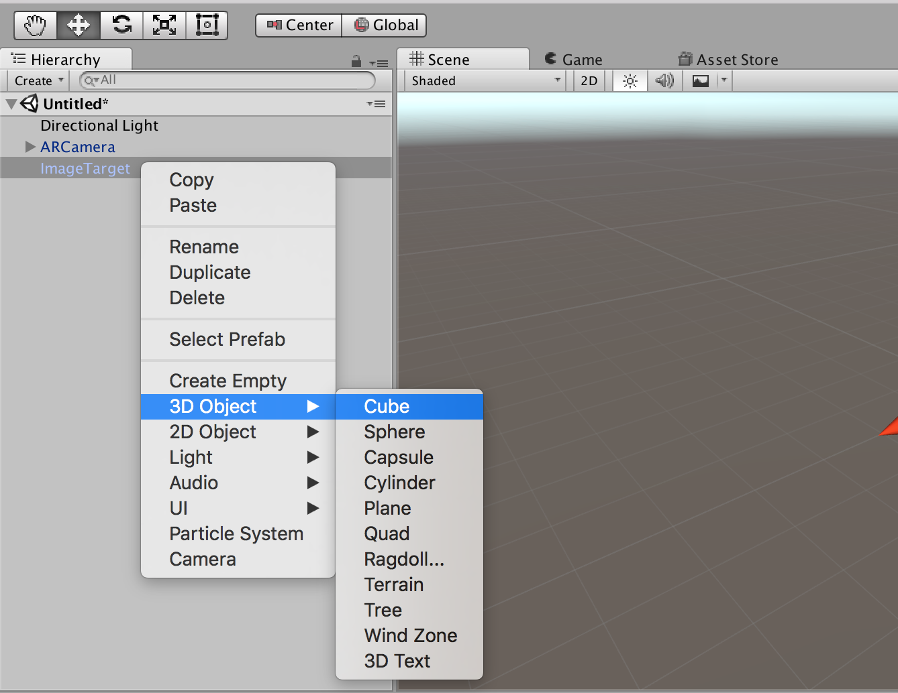
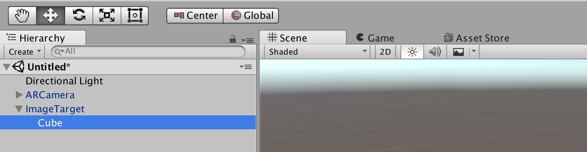
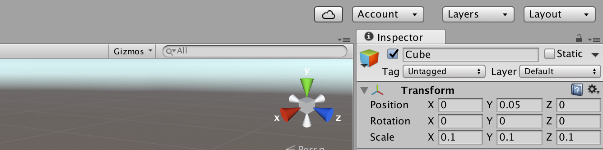
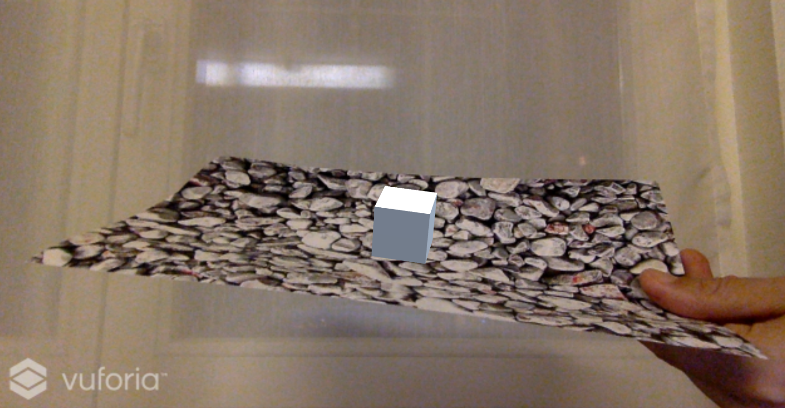
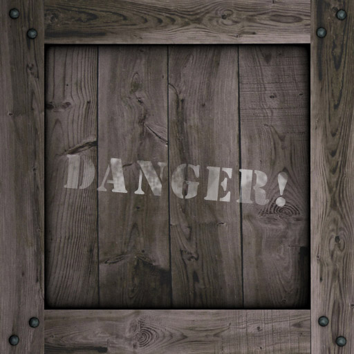
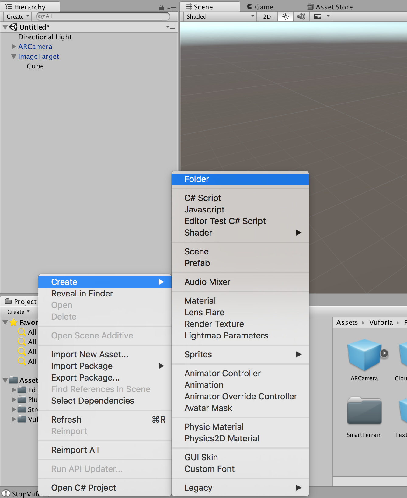
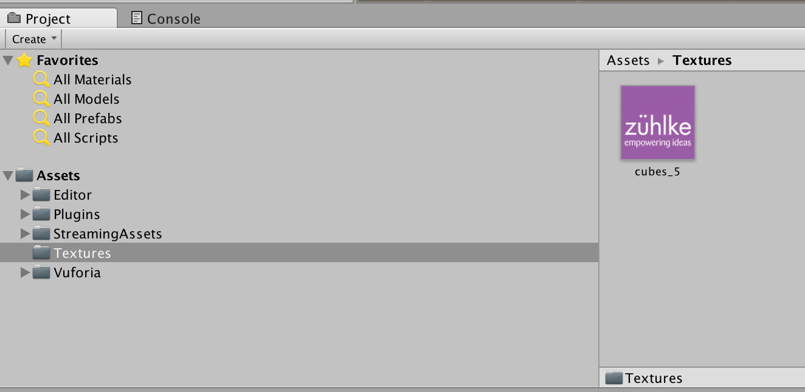
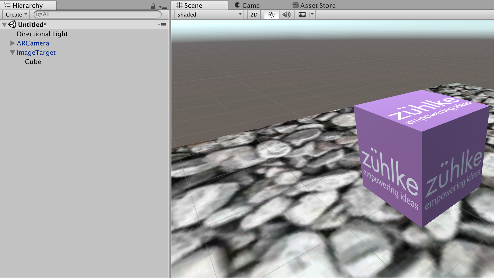

# 8. Add Cubes

* Now we are ready to add a cube:

This object must be a child of the image target:

* Set the `Position` and the `Scale`:

* Press the play button and test the preview:

* Download one texture for the cube (save the image):

| Texture 1                      | Texture 2                      | Texture 3                      |
| ------------------------------ | ------------------------------ | ------------------------------ |
|  |  |  |

* Create a new folder `Textures`:

* Drag the downloaded texture in the `Textures` folder. A texture is an image straight out of an image processing program like Photoshop:

* Drag the texture from the folder on the cube:

You see now that a new material is created automatically. A material is the details of what an object should look like including albedo, emission, reflections etc:

* Press the play button and test the preview:

