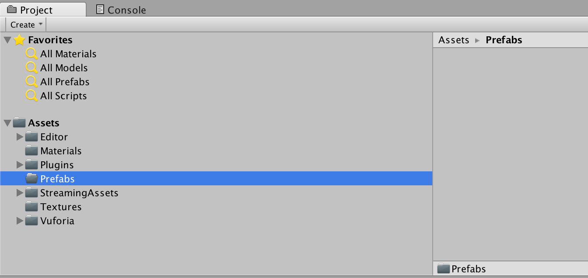
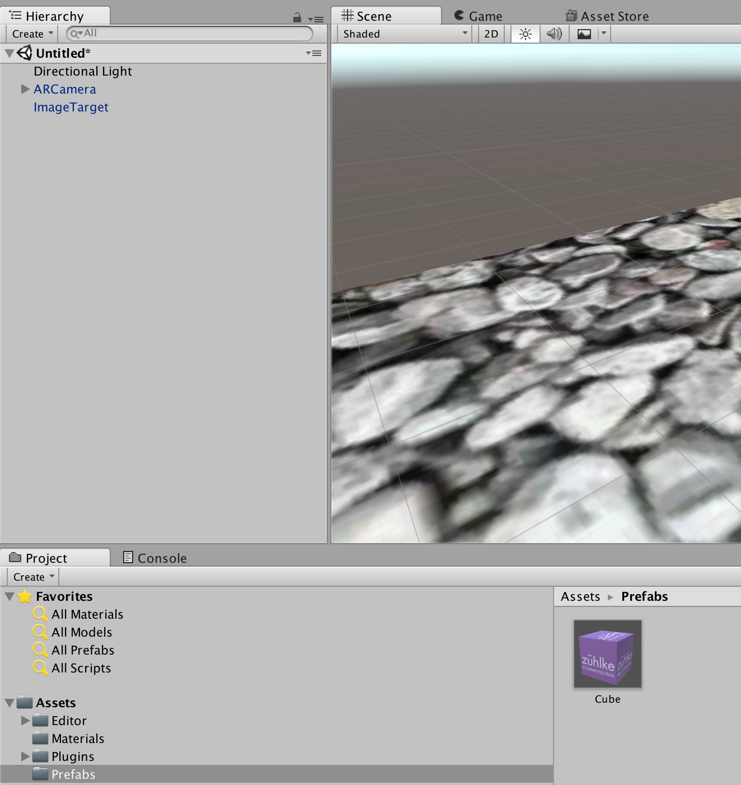
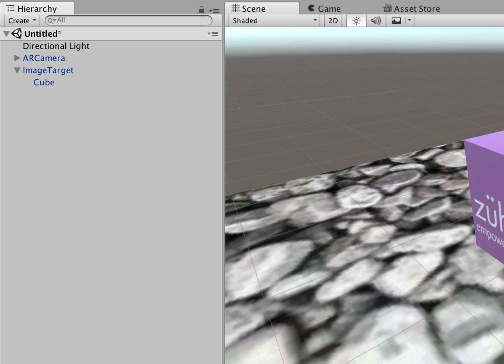
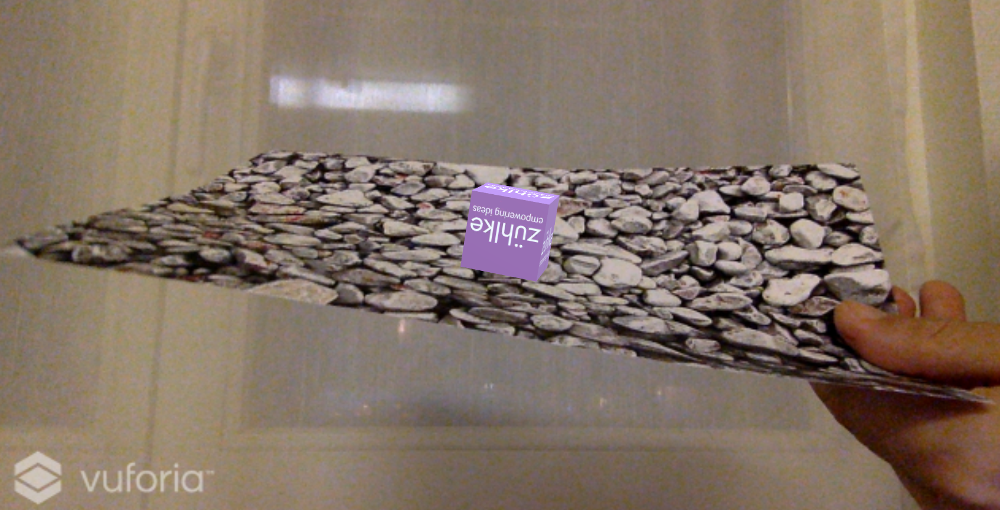

# 9. Create Prefab
Prefabs in Unity are preconfigured game objects that you create in the scene and store in the project. They can then be instantiated or cloned, meaning to create an instance of them during the game.

* Create folder `Prefabs`:

* Drag cube in folder `Prefabs` and delete cube in hierarchy:

* Drag cube prefab to image target:

* Press the play button and test the preview:

