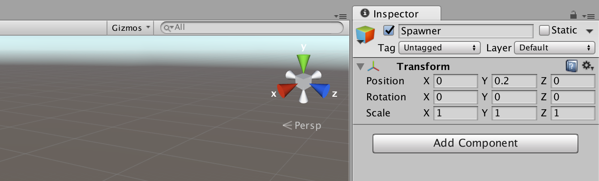
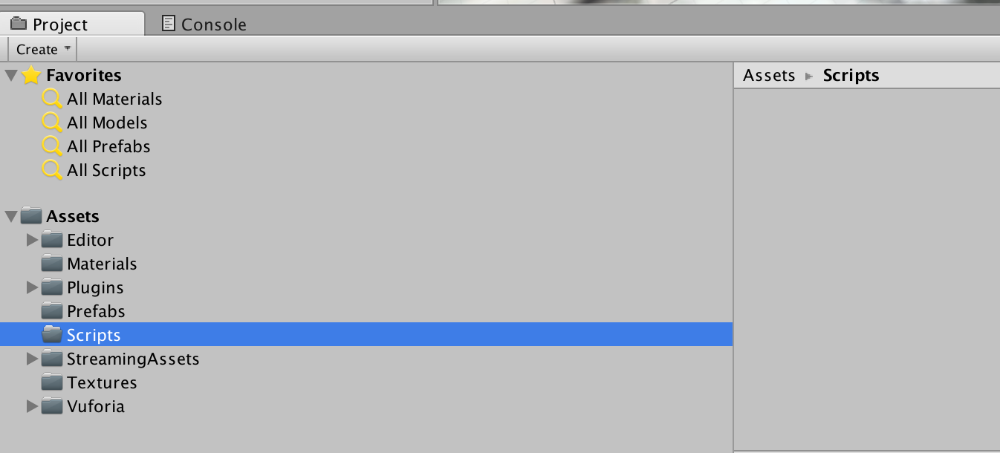
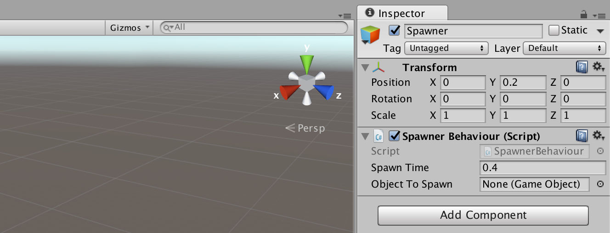
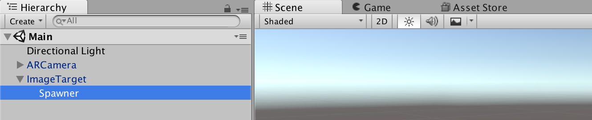
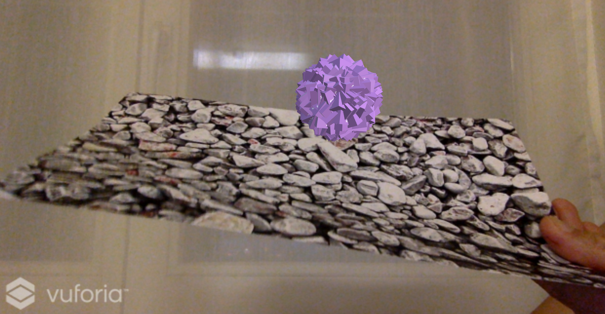
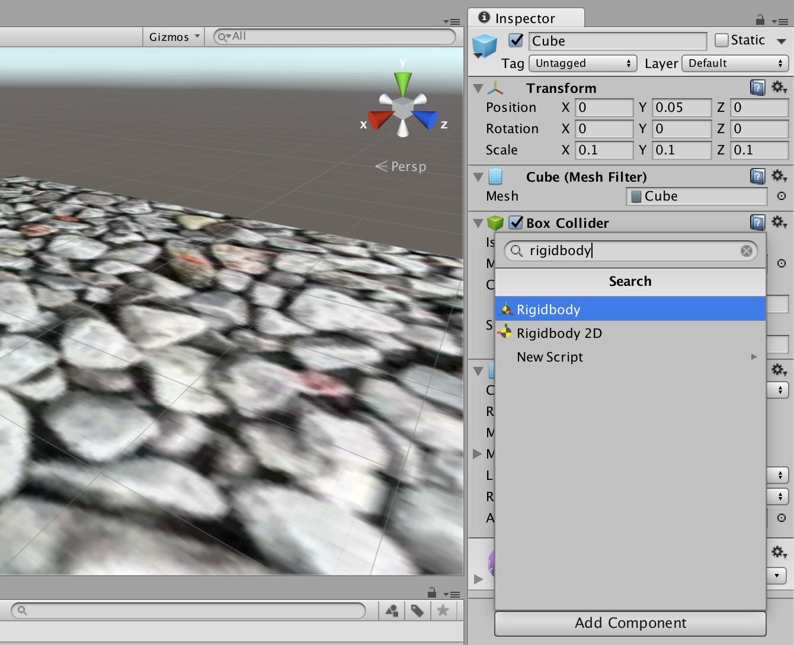
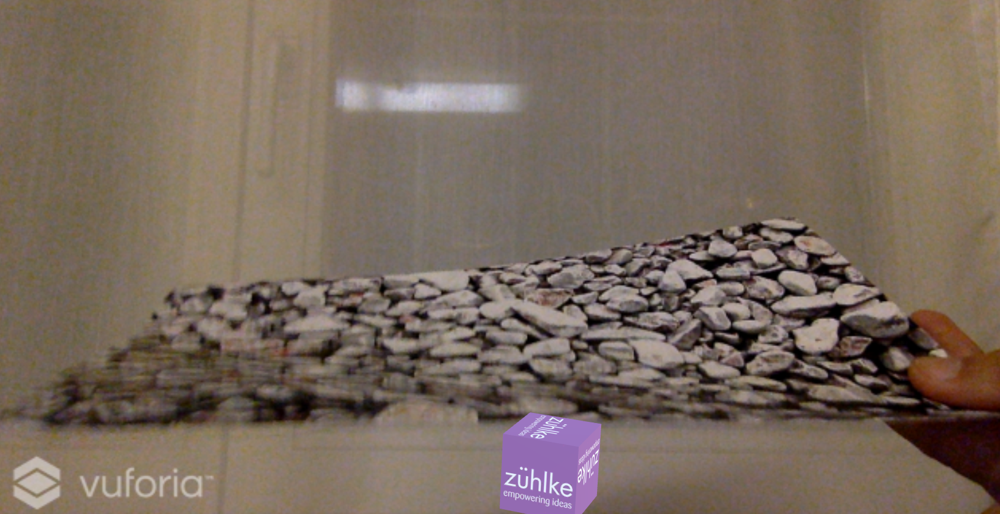
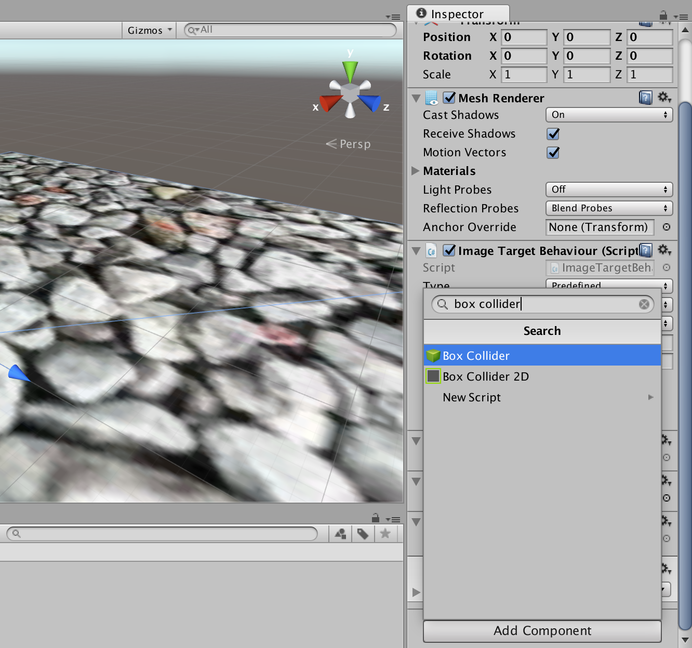
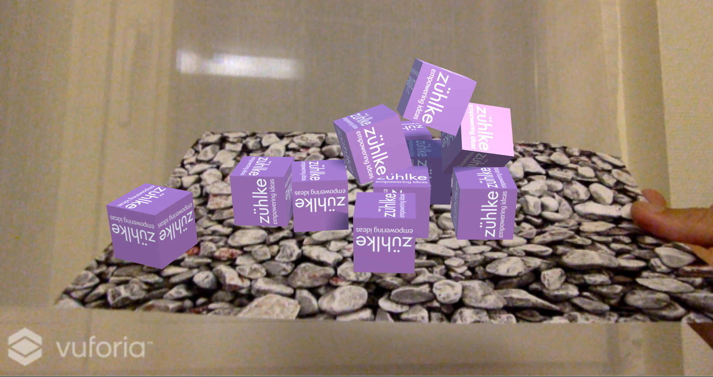

# 10. Create Spawner
We will create a spawner that creates the falling cubes.

* Create an empty `game object`:


* Set `name` and `position`:



We will add a script to the spawner in order to create the falling cubes.

* Create a new folder `Scripts`:



* Add a C# script with filename `SpawnerBehaviour.cs`:


* Insert the following C# code:

```c
using UnityEngine;
using System.Collections;

public class SpawnerBehaviour : MonoBehaviour {

    public float spawnTime = 0.4f;        // How long between each spawn.
    public GameObject objectToSpawn;

    // Use this for initialization
    void Start () {
        // Call the Spawn function after a delay of the spawnTime and then continue to call after the same amount of time.
        InvokeRepeating ("Spawn", spawnTime, spawnTime);
    }

    void Spawn () {
        Instantiate (objectToSpawn, gameObject.transform.position, Random.rotation);
    }
}
```

* Drag the script on the `Spawner` in the hierarchy view:



* Remove the `Cube` from hierarchy:



* Drag cube prefab to public variable `Object to Spawn`.


* Press the play button and test the preview:



Rigidbodies enable your GameObjects to act under the control of physics. The Rigidbody can receive forces and torque to make your objects move in a realistic way:

* Add a Rigidbody to Cube prefab.



* Press the play button and test the preview:



Colliders are a component that allows the game object they're attached to to react to other colliders provided that one of the game objects has a rigidbody component attached.

* Add a Box Collider to Image target:



* Press the play button and test the preview:



The spawn point is not high enough and there are a lot of cubes. So we will change the Y axis of the spawn point and make a script to destroy the cubes after a certain period.

* Set the Spawner `position`:


